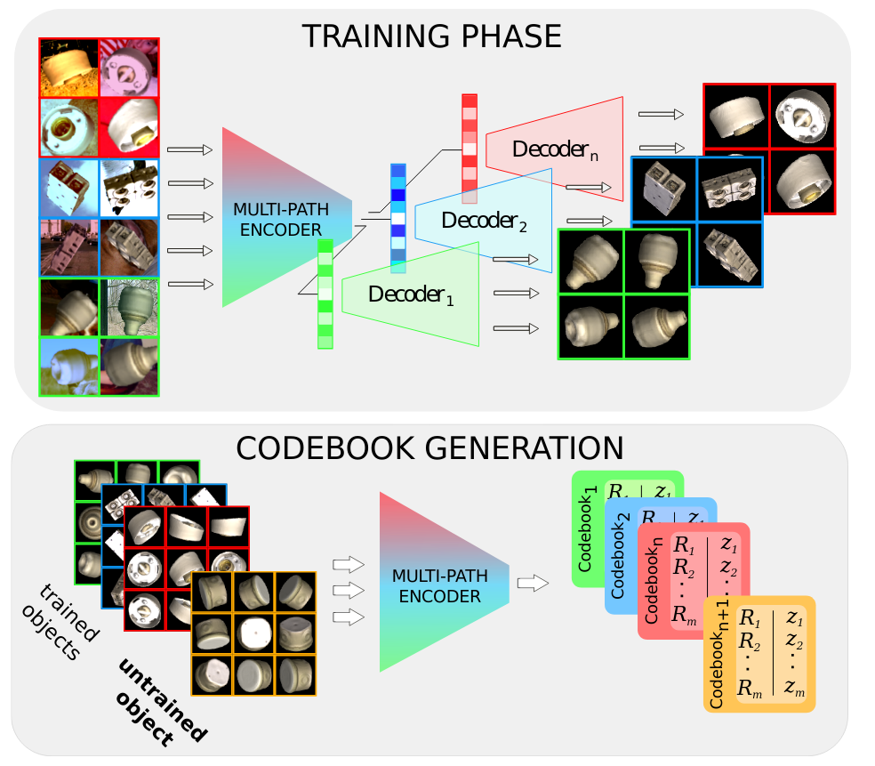
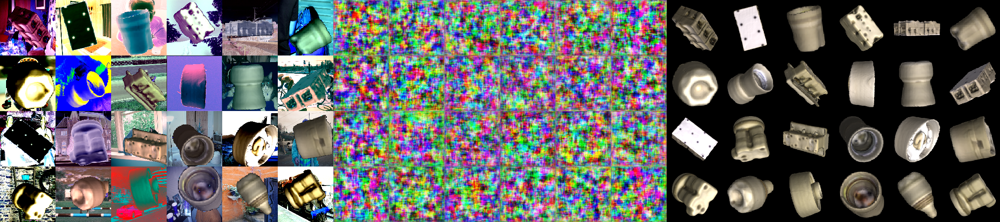

## Multi-path Learning for Object Pose Estimation Across Domains  
Martin Sundermeyer, M. Durner, E. Y. Puang, Z.-C. Marton, N. Vaskevicius, K. Arras, R. Triebel  
CVPR 2020    

[paper + supplement](http://openaccess.thecvf.com/content_CVPR_2020/html/Sundermeyer_Multi-Path_Learning_for_Object_Pose_Estimation_Across_Domains_CVPR_2020_paper.html)

### Citation
If you find Multi-Path Encoders useful for your research, please consider citing:  

```
 @InProceedings{Sundermeyer_2020_CVPR,
author = {Sundermeyer, Martin and Durner, Maximilian and Puang, En Yen and Marton, Zoltan-Csaba and Vaskevicius, Narunas and Arras, Kai O. and Triebel, Rudolph},
title = {Multi-Path Learning for Object Pose Estimation Across Domains},
booktitle = {The IEEE/CVF Conference on Computer Vision and Pattern Recognition (CVPR)},
month = {June},
year = {2020}
}
```

## Overview

<p align="center">

<p>

We introduce a scalable approach for object pose estimation trained on simulated RGB views of multiple 3D models together. We learn an encoding of object views that does not only describe an implicit orientation of all objects seen during training, but can also relate views of untrained objects. Our single-encoder-multi-decoder network is trained using a technique we denote "multi-path learning": While the encoder is shared by all objects, each decoder only reconstructs views of a single object. Consequently, views of different instances do not have to be separated in the latent space and can share common features. The resulting encoder generalizes well from synthetic to real data and across various instances, categories, model types and datasets. We systematically investigate the learned encodings, their generalization, and iterative refinement strategies on the ModelNet40 and T-LESS dataset. Despite training jointly on multiple objects, our 6D Object Detection pipeline achieves state-of-the-art results on T-LESS at much lower runtimes than competing approaches. 


## Minimum Requirements: Hardware
### For Training <= 30 objects 
Nvidia GPU with >4GB memory  
RAM >= 16GB  
### For more objects or faster training
Multiple GPUs with >=8GB memory
RAM >= 64GB

## Requirements: Software

Linux, Python 2.7 / Python 3 (experimental)

GLFW for OpenGL: 
```bash
sudo apt-get install libglfw3-dev libglfw3  
```
Assimp: 
```bash
sudo apt-get install libassimp-dev  
```

Tensorflow 1.13  
OpenCV >= 3.1

```bash
pip install --user --pre --upgrade PyOpenGL PyOpenGL_accelerate
pip install --user cython
pip install --user cyglfw3
pip install --user pyassimp==3.3
pip install --user imgaug
pip install --user progressbar
```

### Headless Rendering
Please note that we use the GLFW context as default which does not support headless rendering. To allow for both, onscreen rendering & headless rendering on a remote server, set the context to EGL: 
```
export PYOPENGL_PLATFORM='egl'
```
In order to make the EGL context work, you might need to change PyOpenGL like [here](https://github.com/mcfletch/pyopengl/issues/27)

## Preparatory Steps

*1. Pip installation*
```bash
pip install --user .
```

*2. Set Workspace path, consider to put this into your bash profile, will always be required*
```bash
export AE_WORKSPACE_PATH=/path/to/autoencoder_ws  
```

*3. Create Workspace, Init Workspace (if installed locally, make sure .local/bin/ is in your PATH)*
```bash
mkdir $AE_WORKSPACE_PATH
cd $AE_WORKSPACE_PATH
ae_init_workspace
```

## Train a Multi-Path Encoder

*1. Create the training config file. Insert the paths to your 3D models and background images and select the number of GPUs and batchsize per GPU.*
```bash
mkdir $AE_WORKSPACE_PATH/cfg/exp_group
cp $AE_WORKSPACE_PATH/cfg/my_mpencoder.cfg $AE_WORKSPACE_PATH/cfg/exp_group/my_mpencoder.cfg
gedit $AE_WORKSPACE_PATH/cfg/exp_group/my_mpencoder.cfg
```

*2. Generate and check training data. The object views should be strongly augmented but identifiable. Middle part shows reconstruction.*

(Press *ESC* to close the window.)
```bash
ae_train exp_group/my_mpencoder -d
```

Output:


*3. Train the model*
(See the [Headless Rendering](#headless-rendering) section if you want to train directly on a server without display)

```bash
ae_train exp_group/my_mpencoder
```

```bash
$AE_WORKSPACE_PATH/experiments/exp_group/my_mpencoder/train_figures
```
Updates during training. Middle part should start showing reconstructions of the input object (if all black, set `TARGET_BG_COLOR: [0,255,0]` in training config under [Dataset])  

*4. For trained and untrained objects, create codebooks with*
```bash
ae_embed_multi exp_group/my_mpencoder --model_path '/path/to/ply_or_off/file'
```

## Evaluate a model

*For the evaluation you will also need*
https://github.com/thodan/sixd_toolkit + our extensions, see sixd_toolkit_extension/help.txt  

### Pretrained Models

Here is an MP-Encoder model trained on the first 18 objects of the T-LESS dataset with codebooks of all 30 objects (paper results):

[Download](https://dlrmax.dlr.de/get/b42e7289-7558-5da0-8f26-4c472ad830a9/)

Extract it to `$AE_WORKSPACE_PATH/experiments/exp_group/obj1_18_v2`

### Evaluate and visualize 6D pose estimation of MP-Encoder with ground truth bounding boxes

Set `gt_masks = True`, `estimate_bbs=False` and `estimate_masks=False` in the evaluation config. Set `external` to the path with the gt masks in npy format. You can download the T-LESS gt masks [here](https://dlrmax.dlr.de/get/540391e2-597e-5bfa-80b1-f74b9ea10db1/):

To evaluate a specific object and visualize predictions execute

```bash
ae_eval exp_group/my_mpencoder name_of_evaluation --eval_cfg eval_group/eval_template.cfg 
e.g.
ae_eval exp_group/obj1_18_v2 test_eval --eval_cfg eval_template.cfg --model_path '/path/to/obj_05.ply'
```

### Evaluate 6D Object Detection based on Mask RCNN

Set `gt_masks = False`, `estimate_bbs=True` and `estimate_masks=True` in the evaluation config. Set `external` to the path with the predicted masks in npy format. You can download our T-LESS MaskRCNN predictions [here](https://dlrmax.dlr.de/get/c677b2a7-78cf-5787-815b-7ba2c26555a7/):   

To evaluate a specific object and visualize predictions execute

```bash
ae_eval exp_group/my_mpencoder name_of_evaluation --eval_cfg eval_group/eval_template.cfg
e.g.
ae_eval multi_object/obj1_18_v2 test_eval --eval_cfg eval_template.cfg --model_path '/path/to/obj_05.ply'
```
We trained a MaskRCNN on the T-LESS training set pasted randomly on COCO images using https://github.com/facebookresearch/maskrcnn-benchmark

### Reproducing and visualizing BOP challenge 2020 results

Here is an MP-Encoder model trained on 80 objects from BOP datasets with codebooks of all 108 objects (BOP Challenge 2020 results):

[Download](https://dlrmax.dlr.de/get/87f2bcb2-6224-517e-94d1-e6a49d18aaa1/)

Extract it to `$AE_WORKSPACE_PATH/experiments/multi_object/bop_except_itodd`

Also get precomputed MaskRCNN predictions for all BOP datasets:

[Download](https://dlrmax.dlr.de/get/cd6df1ae-e096-5424-9a7f-b8443e0c86e3/)

Open the bop20 evaluation configs, e.g. `auto_pose/ae/cfg_m3vision/m3_config_lmo_mp.cfg`, and point the `path_to_masks` parameter to the downloaded maskrcnn predictions.

You can visualize (-vis option) and reproduce BOP results by running:

```bash
python auto_pose/m3_interface/compute_bop_results_m3.py auto_pose/ae/cfg_m3vision/m3_config_lmo_mp.cfg 
                                                     --eval_name test 
                                                     --dataset_name=lmo 
                                                     --datasets_path=/path/to/bop/datasets 
                                                     --result_folder /folder/to/results 
                                                     -vis
```
Note: You will need the [bop_toolkit](https://github.com/thodan/bop_toolkit). I created a package `bop_toolkit_lib` from it, but you can also just add the required files to sys.path()

### Test on your own data

After creating the mp_encoder codebooks, adapt the parameters in an m3 config file `auto_pose/ae/cfg_m3vision/m3_template.cfg`.

`auto_pose/m3_interface/test_m3.py` shows an example how to use the API for 6-DoF pose estimation. Insert your own detector / bounding boxes and then run 

```bash
python auto_pose/m3_interface/test_m3.py --m3_config_path=/path/to/cfg_m3vision/m3_template.cfg 
                                         --img_path=/path/to/an/img.png
                                         -vis
```


### ToDo
- Document ModelNet Evaluation
