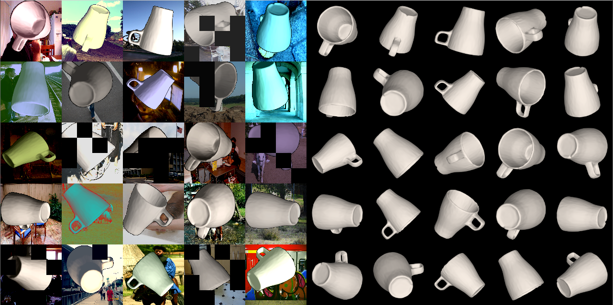

# Augmented AutoEncoder for Real-Time 6D Object Pose Estimation
# Tensorflow Implementation
# Overview

1.) Train AAE using only a 3D model to predict 3D Object Orientations from image crops\
2.) For full RGB-based 6D pose estimation, also train a 2D Object Detector \
    (inference pipeline supports https://rmc-github.robotic.dlr.de/moro/single_shot_multibox_detector) \
3.) Optionally use a standard depth-based ICP to refine the 6D Pose (slower)

# Usage
### Preparatory Steps
*1.1 rmpm environment*
```bash
eval `rmpm_do env --env-format embed_sh auto_pose/training`
```
or \
*1.2 Local pip installation*
```bash
make
```

*2. Set Workspace path, Add executables to path, consider to put this into your bash profile*
```bash
export AE_WORKSPACE_PATH=/home_local/$USER/autoencoder_ws
export PATH=$HOME/.local/bin:$PATH
```

*3. Create Workspace, Init Workspace*
```bash
mkdir $AE_WORKSPACE_PATH
cd $AE_WORKSPACE_PATH
ae_init_workspace
```

### Train A Model

*1. Modify the config file*
```bash
mkdir $AE_WORKSPACE_PATH/cfg/exp_group
cp $AE_WORKSPACE_PATH/cfg/train_template.cfg $AE_WORKSPACE_PATH/cfg/exp_group/my_autoencoder.cfg
gedit $AE_WORKSPACE_PATH/cfg/exp_group/my_autoencoder.cfg
```

*2. Generate and check training data*
(Press *ESC* to close the window.)
```bash
ae_train exp_group/my_autoencoder -d
```
This command does not start training.
Output:


*3. Train the model*
```bash
ae_train exp_group/my_autoencoder
```

*4. Create the embedding*
```bash
ae_embed exp_group/my_autoencoder
```

### Use A Model

look at test/

```python
import tensorflow as tf
import os
from ae import ae_factory, utils

workspace_path = os.environ.get('AE_WORKSPACE_PATH')
if workspace_path == None:
    print 'Please define a workspace path:\n'
    print 'export AE_WORKSPACE_PATH=/path/to/workspace\n'
    exit(-1)


experiment_group = 'exp_group'      # optional
experiment_name = 'my_autoencoder'

log_dir = utils.get_log_dir(workspace_path,experiment_name,experiment_group)
ckpt_dir = utils.get_checkpoint_dir(log_dir)

codebook, dataset = ae_factory.build_codebook_from_name(experiment_name, experiment_group = experiment_group, return_dataset=True)

with tf.Session() as sess:
    ae_factory.restore_checkpoint(sess, tf.train.Saver(), ckpt_dir)
    img = webcam.snapshot()
    R_obj2cam = codebook.nearest_rotation(session, img)
    print R_obj2cam  # OpenCV coordinates
```
Example output:
```bash
[[ 1.          0.          0.        ]
 [ 0.         -0.85065081 -0.52573111]
 [ 0.          0.52573111 -0.85065081]]
```
More examples can be found in test/

# Config file parameters
```yaml
[Paths]
# Path to the model file. All formats supported by assimp should work. Tested with ply files.
MODEL_PATH: /net/rmc-lx0050/home_local/sund_ma/data/t-less/models_reconst/obj_05.ply
# Path to some background image folder. Should contain a * as a placeholder for the image name.
BACKGROUND_IMAGES_GLOB: /net/rmc-lx0050/home_local/sund_ma/data/VOCdevkit/VOC2012/JPEGImages/*.jpg

[Dataset]
#cad or reconst (with texture)
MODEL: reconst
# Height of the AE input layer
H: 128
# Width of the AE input layer
W: 128
# Channels of the AE input layer (default BGR)
C: 3
# Distance from Camera to the object in mm for synthetic training images
RADIUS: 700
# Dimensions of the renderered image, it will be cropped and rescaled to H, W later.
RENDER_DIMS: (720, 540)
# Camera matrix used for rendering and optionally for estimating depth from RGB
K: [1075.65, 0, 720/2, 0, 1073.90, 540/2, 0, 0, 1]
# Vertex scale. Vertices need to be scaled to mm
VERTEX_SCALE: 1
# Antialiasing factor used for rendering
ANTIALIASING: 8
# Padding rendered object images and potentially bounding box detections 
PAD_FACTOR: 1.2
# Near plane
CLIP_NEAR: 10
# Far plane
CLIP_FAR: 10000
# Number of training images rendered uniformly at random from SO(3)
NOOF_TRAINING_IMGS: 10000
# Number of background images that simulate clutter
NOOF_BG_IMGS: 10000

[Augmentation]
# Using real object masks for occlusion (not really necessary)
REALISTIC_OCCLUSION: False
# During training an offset is sampled from Normal(0, CROP_OFFSET_SIGMA) and added to the ground truth crop.
CROP_OFFSET_SIGMA: 20
# Random augmentations at random strengths from imgaug library
CODE: Sequential([
    #Sometimes(0.5, PerspectiveTransform(0.05)),
    #Sometimes(0.5, CropAndPad(percent=(-0.05, 0.1))),
    Sometimes(0.5, Affine(scale=(1.0, 1.2))),
    Sometimes(0.5, CoarseDropout( p=0.2, size_percent=0.05) ),
    Sometimes(0.5, GaussianBlur(1.2*np.random.rand())),
    Sometimes(0.5, Add((-25, 25), per_channel=0.3)),
    Sometimes(0.3, Invert(0.2, per_channel=True)),
    Sometimes(0.5, Multiply((0.6, 1.4), per_channel=0.5)),
    Sometimes(0.5, Multiply((0.6, 1.4))),
    Sometimes(0.5, ContrastNormalization((0.5, 2.2), per_channel=0.3))
    ], random_order=False)

[Embedding]
# for every rotation save rendered bounding box for projective distance estimation (RGB)
EMBED_BB: True
# minimum number of equidistant views rendered from a view-sphere
MIN_N_VIEWS: 2562
# for each view generate a number of in-plane rotations to cover full SO(3)
NUM_CYCLO: 36

[Network]
# additionally reconstruct segmentation mask, helps when AAE decodes pure blackness
AUXILIARY_MASK: False
# Variational Autoencoder, factor in front of KL-Divergence loss
VARIATIONAL: 0
# Reconstruction error metric
LOSS: L2
# Only evaluate 1/BOOTSTRAP_RATIO of the pixels with highest errors, produces sharper edges
BOOTSTRAP_RATIO: 4
# regularize norm of latent variables
NORM_REGULARIZE: 0
# size of the latent space
LATENT_SPACE_SIZE: 128
# number of filters in every Conv layer (decoder mirrored)
NUM_FILTER: [128, 256, 512, 512]
# stride for encoder layers, nearest neighbor upsampling for decoder layers
STRIDES: [2, 2, 2, 2]
# filter size encoder
KERNEL_SIZE_ENCODER: 5
# filter size decoder
KERNEL_SIZE_DECODER: 5


[Training]
OPTIMIZER: Adam
NUM_ITER: 30000
BATCH_SIZE: 64
LEARNING_RATE: 1e-4
SAVE_INTERVAL: 5000

[Queue]
# number of threads for producing augmented training data (online)
NUM_THREADS: 10
# preprocessing queue size in number of batches
QUEUE_SIZE: 50